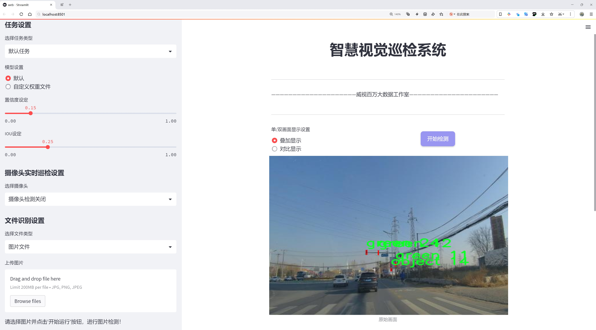
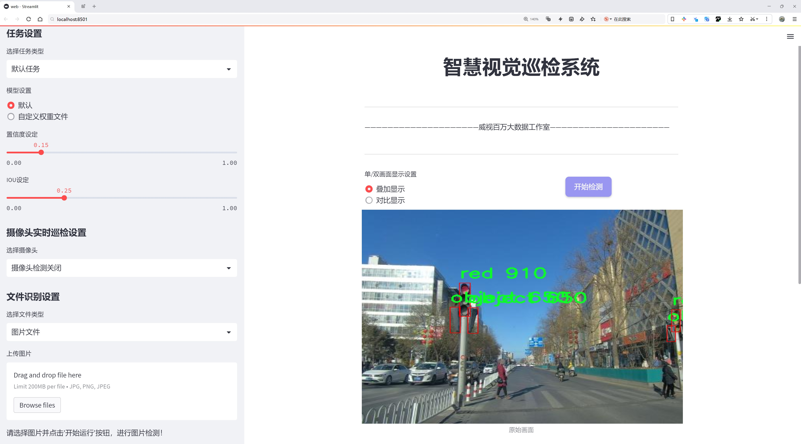
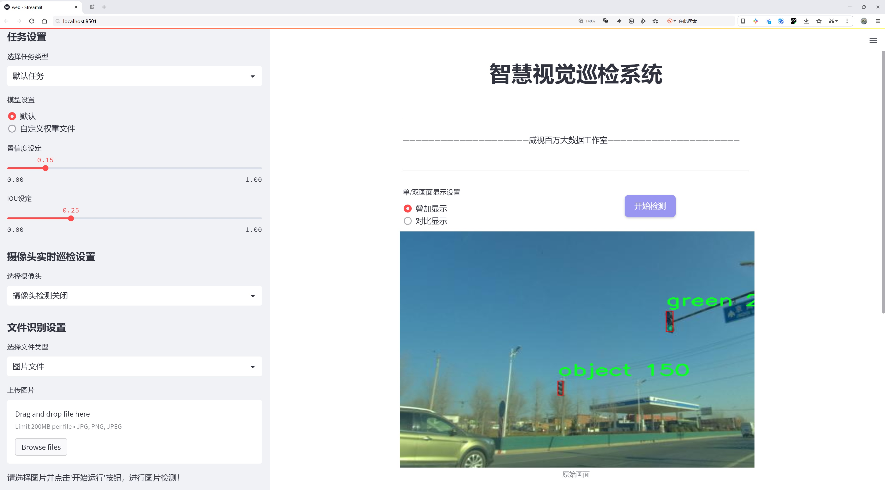
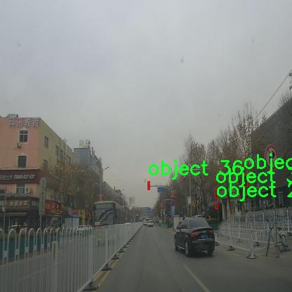
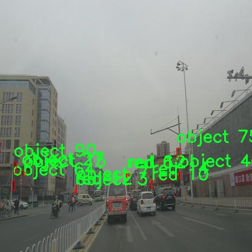
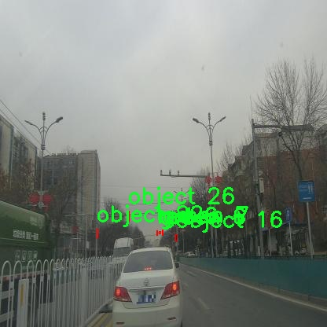
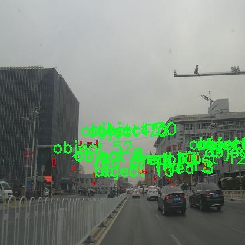
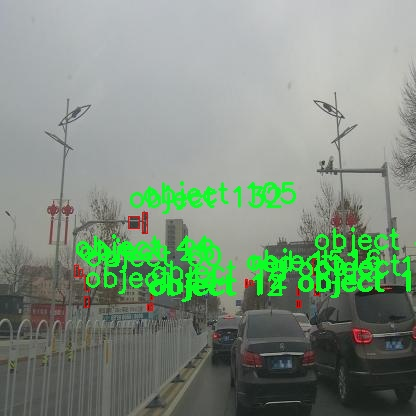

# 信号灯检测检测系统源码分享
 # [一条龙教学YOLOV8标注好的数据集一键训练_70+全套改进创新点发刊_Web前端展示]

### 1.研究背景与意义

项目参考[AAAI Association for the Advancement of Artificial Intelligence](https://gitee.com/qunshansj/projects)

项目来源[AACV Association for the Advancement of Computer Vision](https://gitee.com/qunmasj/projects)

研究背景与意义

随着城市化进程的加快，交通管理的复杂性日益增加，交通信号灯作为城市交通系统的重要组成部分，承担着引导车辆和行人安全通行的关键角色。然而，传统的交通信号灯监测方式往往依赖人工巡查，不仅效率低下，而且容易受到人为因素的影响，导致信号灯故障或误判的情况频繁发生。因此，构建一个高效、准确的信号灯检测系统显得尤为重要。近年来，深度学习技术的迅猛发展为计算机视觉领域带来了新的机遇，尤其是目标检测算法的进步，使得信号灯的自动检测成为可能。

在众多目标检测算法中，YOLO（You Only Look Once）系列算法因其高效性和实时性受到广泛关注。YOLOv8作为该系列的最新版本，结合了更为先进的网络结构和优化策略，具备了更强的特征提取能力和更快的推理速度。基于YOLOv8的信号灯检测系统，能够在复杂的交通环境中快速、准确地识别信号灯的状态，从而为智能交通系统的建设提供有力支持。

本研究将利用一个包含2600张图像的数据集，该数据集涵盖了四类信号灯状态：绿色、红色、黄色和物体。通过对这些图像的分析与处理，系统能够在不同的光照和天气条件下，准确识别信号灯的状态。这一数据集的构建，不仅为算法的训练提供了丰富的样本，也为后续的模型评估和优化奠定了基础。通过对不同类别信号灯的准确检测，系统将能够实时反馈信号灯的状态，为交通管理提供数据支持，进而提升城市交通的安全性和流畅性。

此外，基于改进YOLOv8的信号灯检测系统还具有广泛的应用前景。随着智能交通系统的不断发展，该系统可以与其他交通管理系统进行联动，实现对交通流量的智能调控，减少交通拥堵，提高道路使用效率。同时，该系统还可以为自动驾驶技术的研发提供重要的数据支持，助力智能驾驶的安全性和可靠性。

综上所述，基于改进YOLOv8的信号灯检测系统的研究，不仅具有重要的理论意义，也具有广泛的实际应用价值。通过深入探讨信号灯检测技术的发展与应用，推动智能交通系统的建设，将为未来的城市交通管理提供新的解决方案，促进交通安全与效率的提升。

### 2.图片演示







##### 注意：由于此博客编辑较早，上面“2.图片演示”和“3.视频演示”展示的系统图片或者视频可能为老版本，新版本在老版本的基础上升级如下：（实际效果以升级的新版本为准）

  （1）适配了YOLOV8的“目标检测”模型和“实例分割”模型，通过加载相应的权重（.pt）文件即可自适应加载模型。

  （2）支持“图片识别”、“视频识别”、“摄像头实时识别”三种识别模式。

  （3）支持“图片识别”、“视频识别”、“摄像头实时识别”三种识别结果保存导出，解决手动导出（容易卡顿出现爆内存）存在的问题，识别完自动保存结果并导出到tempDir中。

  （4）支持Web前端系统中的标题、背景图等自定义修改，后面提供修改教程。

  另外本项目提供训练的数据集和训练教程,暂不提供权重文件（best.pt）,需要您按照教程进行训练后实现图片演示和Web前端界面演示的效果。

### 3.视频演示

[3.1 视频演示](https://www.bilibili.com/video/BV1Rp4SexENU/)

### 4.数据集信息展示

##### 4.1 本项目数据集详细数据（类别数＆类别名）

nc: 4
names: ['green', 'object', 'red', 'yellow']


##### 4.2 本项目数据集信息介绍

数据集信息展示

在本研究中，我们采用了名为“Example1”的数据集，以训练和改进YOLOv8信号灯检测系统。该数据集专门设计用于信号灯的分类与检测，包含了四个主要类别，分别是绿色、红色、黄色和其他物体（object）。这些类别的选择不仅涵盖了交通信号灯的基本颜色，还考虑到了可能在交通场景中出现的其他相关物体，以提高模型的泛化能力和准确性。

“Example1”数据集的构建经过精心设计，确保其在多样性和代表性方面都能满足信号灯检测的需求。数据集中包含了大量的图像样本，这些样本在不同的环境条件下拍摄，包括白天和夜晚、晴天和雨天等多种天气状况。这种多样性使得模型在训练过程中能够学习到不同光照和气候条件下信号灯的外观特征，从而增强其在实际应用中的鲁棒性。

在类别方面，绿色信号灯代表着通行的信号，红色信号灯则表示停车的指示，黄色信号灯通常用来提醒驾驶员即将变为红灯，而“object”类别则涵盖了其他可能干扰信号灯检测的物体，如行人、车辆或其他交通标志。这种分类不仅有助于提高模型的准确性，还能有效减少误报率，使得信号灯检测系统在复杂交通环境中能够更加可靠地工作。

为了进一步提升数据集的有效性，我们在数据预处理阶段进行了数据增强，包括旋转、缩放、裁剪和颜色调整等操作。这些增强技术不仅增加了数据集的样本数量，还帮助模型学习到信号灯在不同视角和条件下的表现，从而提高了其在实际应用中的适应能力。此外，数据集中还标注了每个信号灯的具体位置和类别信息，确保在训练过程中，模型能够准确地识别和定位信号灯。

在训练过程中，我们将“Example1”数据集与YOLOv8模型相结合，利用其强大的特征提取能力和实时检测性能，旨在实现高效的信号灯检测。通过不断迭代训练和验证，我们期望能够显著提高模型在信号灯检测任务中的表现，最终实现对交通信号灯的精准识别和实时响应。

综上所述，“Example1”数据集为本研究提供了坚实的基础，其丰富的类别信息和多样的样本特征使得YOLOv8信号灯检测系统的训练更加高效和可靠。通过对该数据集的深入分析和应用，我们希望能够推动信号灯检测技术的发展，为智能交通系统的建设贡献力量。











### 5.全套项目环境部署视频教程（零基础手把手教学）

[5.1 环境部署教程链接（零基础手把手教学）](https://www.ixigua.com/7404473917358506534?logTag=c807d0cbc21c0ef59de5)


[5.2 安装Python虚拟环境创建和依赖库安装视频教程链接（零基础手把手教学）](https://www.ixigua.com/7404474678003106304?logTag=1f1041108cd1f708b01a)

### 6.手把手YOLOV8训练视频教程（零基础小白有手就能学会）

[6.1 手把手YOLOV8训练视频教程（零基础小白有手就能学会）](https://www.ixigua.com/7404477157818401292?logTag=d31a2dfd1983c9668658)

### 7.70+种全套YOLOV8创新点代码加载调参视频教程（一键加载写好的改进模型的配置文件）

[7.1 70+种全套YOLOV8创新点代码加载调参视频教程（一键加载写好的改进模型的配置文件）](https://www.ixigua.com/7404478314661806627?logTag=29066f8288e3f4eea3a4)

### 8.70+种全套YOLOV8创新点原理讲解（非科班也可以轻松写刊发刊，V10版本正在科研待更新）

由于篇幅限制，每个创新点的具体原理讲解就不一一展开，具体见下列网址中的创新点对应子项目的技术原理博客网址【Blog】：


[8.1 70+种全套YOLOV8创新点原理讲解链接](https://gitee.com/qunmasj/good)

### 9.系统功能展示（检测对象为举例，实际内容以本项目数据集为准）

图9.1.系统支持检测结果表格显示

  图9.2.系统支持置信度和IOU阈值手动调节

  图9.3.系统支持自定义加载权重文件best.pt(需要你通过步骤5中训练获得)

  图9.4.系统支持摄像头实时识别

  图9.5.系统支持图片识别

  图9.6.系统支持视频识别

  图9.7.系统支持识别结果文件自动保存

  图9.8.系统支持Excel导出检测结果数据


### 10.原始YOLOV8算法原理

原始YOLOv8算法原理

YOLOv8是Ultralytics于2023年1月发布的一款新型目标检测模型，它不仅继承了YOLO系列的优良传统，还融合了YOLOX、YOLOv6、YOLOv7以及PPYOLOE等多种先进设计理念，尤其在Head标签分配和Loss计算方面与PP-YOLOE有着显著的相似性。YOLOv8的推出标志着实时目标检测技术的一次重大飞跃，其高精度和快速响应能力为各类应用场景，尤其是农业自动化和智能监控等领域，带来了新的机遇。

YOLOv8的网络结构主要由四个核心模块组成：输入端、主干网络、Neck端和输出端。输入端负责对输入图像进行预处理，采用了Mosaic数据增强、自适应图像缩放和灰度填充等技术，以提高模型的鲁棒性和适应性。主干网络则是YOLOv8的特征提取核心，采用了CSPDarknet结构，利用卷积和池化等操作提取图像特征。值得注意的是，YOLOv8引入了C2f模块，这一模块通过将输入特征图分为两个分支，分别进行降维处理，从而有效提升了特征图的维度和信息流动性。

在特征提取的过程中，YOLOv8还采用了快速空间金字塔池化（SPPF）结构，以便在不同尺度上提取特征。这一设计不仅减少了模型的参数量和计算量，还提高了特征提取的效率，使得YOLOv8在处理复杂场景时表现得更加出色。Neck端则基于路径聚合网络（PAN）结构，通过上采样和下采样的方式对不同尺度的特征图进行融合，从而形成更为丰富的特征表示。此处的特征融合对于小目标的检测尤为重要，因为小目标往往在复杂背景中难以被准确识别。

YOLOv8的输出端采用了解耦头（Decoupled Head）结构，能够将分类和回归过程分开进行，从而提高了模型的灵活性和准确性。在样本匹配过程中，YOLOv8使用了Task-Aligned Assigner方法，通过对分类分数和回归分数进行加权，确保正样本的匹配更加精准。损失计算方面，YOLOv8结合了二元交叉熵损失（BCE）和分布聚焦损失（DFL），并使用了完整交并比损失（CIoU），以优化模型的学习过程和泛化能力。

相较于传统的基于锚框的检测方法，YOLOv8采用了无锚框（Anchor-Free）检测策略，直接预测目标的中心点和宽高比。这一创新显著提高了检测速度和准确度，尤其在复杂环境下，YOLOv8展现出了更强的适应能力。然而，在一些特定场景中，例如复杂水面环境中的小目标漂浮物检测，YOLOv8仍然面临着定位误差和目标感知能力不足的问题。

为了解决这些问题，本文提出了YOLOv8-WSSOD算法的改进方案。首先，为了减轻主干网络在下采样过程中噪声的影响，我们引入了捕获远程依赖的思想，采用了双层路由注意力机制（BiFormer）构建C2fBF模块，从而保留特征提取过程中更细粒度的上下文信息。其次，针对小目标漏检的问题，我们添加了一个更小的检测头，以提升网络对小目标的感知能力。此外，在Neck端引入了GSConv和Slim-neck技术，以保持检测精度的同时降低计算量。最后，使用MPDIoU损失函数替换CIoU损失函数，进一步提高了模型的泛化能力和精准度。

综上所述，YOLOv8不仅在结构设计上进行了多项创新，还在算法性能上达到了新的高度。它的实时检测能力和高精度特性使其在各类应用中展现出广泛的前景，尤其是在自动化农业领域的苹果采摘任务中，YOLOv8的视觉识别能力能够有效地检测和定位苹果，为自动采摘机器人提供了强有力的支持。通过结合蚁群算法进行路径规划，自动采摘机器人能够快速而高效地完成苹果的采摘任务，从而推动农业生产的智能化和自动化进程。随着YOLOv8的不断发展和优化，未来在目标检测领域的应用将更加广泛，推动相关技术的进一步进步。


### 11.项目核心源码讲解（再也不用担心看不懂代码逻辑）

#### 11.1 ui.py

以下是对给定代码的核心部分进行提炼和详细注释的版本：

```python
import sys  # 导入sys模块，用于访问与Python解释器紧密相关的变量和函数
import subprocess  # 导入subprocess模块，用于创建新进程、连接到它们的输入/输出/错误管道，并获取返回码
from QtFusion.path import abs_path  # 从QtFusion.path模块导入abs_path函数，用于获取文件的绝对路径

def run_script(script_path):
    """
    使用当前 Python 环境运行指定的脚本。

    Args:
        script_path (str): 要运行的脚本路径

    Returns:
        None
    """
    # 获取当前 Python 解释器的路径
    python_path = sys.executable

    # 构建运行命令，使用streamlit运行指定的脚本
    command = f'"{python_path}" -m streamlit run "{script_path}"'

    # 执行命令，并等待其完成
    result = subprocess.run(command, shell=True)
    
    # 检查命令执行的返回码，如果不为0则表示出错
    if result.returncode != 0:
        print("脚本运行出错。")

# 程序入口
if __name__ == "__main__":
    # 指定要运行的脚本路径，并获取其绝对路径
    script_path = abs_path("web.py")

    # 调用函数运行指定的脚本
    run_script(script_path)
```

### 代码核心部分说明：
1. **模块导入**：
   - `sys`：用于获取当前Python解释器的路径。
   - `subprocess`：用于执行外部命令并获取其结果。
   - `abs_path`：用于获取文件的绝对路径，确保脚本路径正确。

2. **`run_script`函数**：
   - 该函数接收一个脚本路径作为参数，构建并执行一个命令来运行该脚本。
   - 使用`subprocess.run`来执行命令，并检查返回码以判断脚本是否成功运行。

3. **主程序入口**：
   - 通过`if __name__ == "__main__":`确保代码仅在直接运行时执行。
   - 获取`web.py`的绝对路径，并调用`run_script`函数来运行该脚本。

这个程序文件名为 `ui.py`，它的主要功能是运行一个指定的 Python 脚本，具体来说是使用 Streamlit 框架来启动一个 Web 应用。

首先，文件中导入了一些必要的模块，包括 `sys`、`os` 和 `subprocess`。`sys` 模块用于访问与 Python 解释器相关的变量和函数，`os` 模块提供了与操作系统交互的功能，而 `subprocess` 模块则用于执行外部命令。

接下来，程序定义了一个名为 `run_script` 的函数，该函数接受一个参数 `script_path`，这个参数是要运行的脚本的路径。函数内部首先获取当前 Python 解释器的路径，存储在 `python_path` 变量中。然后，构建一个命令字符串 `command`，这个命令会使用当前的 Python 解释器和 Streamlit 模块来运行指定的脚本。

通过调用 `subprocess.run` 方法，程序执行构建好的命令。如果脚本运行的返回码不为零，表示执行过程中出现了错误，程序会打印出“脚本运行出错”的提示信息。

在文件的最后部分，使用 `if __name__ == "__main__":` 语句来确保只有在直接运行该文件时，下面的代码才会被执行。这里指定了要运行的脚本路径 `script_path`，它通过调用 `abs_path` 函数来获取 `web.py` 的绝对路径。最后，调用 `run_script` 函数来执行这个脚本。

总的来说，这个程序的主要目的是提供一个简单的接口，通过命令行来启动一个 Streamlit Web 应用，便于开发和测试。

#### 11.2 70+种YOLOv8算法改进源码大全和调试加载训练教程（非必要）\ultralytics\nn\__init__.py

```python
# 导入所需的模型任务类和函数
from .tasks import (BaseModel, ClassificationModel, DetectionModel, SegmentationModel, 
                    attempt_load_one_weight, attempt_load_weights, guess_model_scale, 
                    guess_model_task, parse_model, torch_safe_load, yaml_model_load)

# 定义模块的公开接口，方便外部调用
__all__ = ('attempt_load_one_weight', 'attempt_load_weights', 'parse_model', 'yaml_model_load', 
           'guess_model_task', 'guess_model_scale', 'torch_safe_load', 
           'DetectionModel', 'SegmentationModel', 'ClassificationModel', 'BaseModel')
```

### 代码注释说明：

1. **导入模块**：
   - 从当前包的 `tasks` 模块中导入了多个类和函数。这些类和函数是模型训练和推理过程中常用的工具，包括基础模型类和特定任务的模型类（如分类、检测和分割模型），以及一些辅助函数（如加载权重、解析模型等）。

2. **公开接口 `__all__`**：
   - `__all__` 是一个特殊的变量，用于定义当使用 `from module import *` 语句时，哪些名称会被导入。这里列出了所有希望公开的函数和类，确保用户可以方便地访问这些核心功能，而不需要了解模块内部的实现细节。

这个程序文件是YOLO（You Only Look Once）系列算法的一个模块，属于Ultralytics YOLO的实现部分。文件的主要功能是导入与模型相关的类和函数，以便在其他地方使用。

首先，文件开头有一个注释，表明这是Ultralytics YOLO的代码，并且该代码遵循AGPL-3.0许可证。这意味着该代码是开源的，用户可以自由使用和修改，但需要遵循相应的许可证条款。

接下来，文件通过相对导入的方式引入了一系列模型和功能，包括基础模型（BaseModel）、分类模型（ClassificationModel）、检测模型（DetectionModel）、分割模型（SegmentationModel）等。这些模型是YOLO框架中用于不同任务的核心组件。

此外，文件还导入了一些辅助函数，例如：
- `attempt_load_one_weight`：尝试加载单个权重文件。
- `attempt_load_weights`：尝试加载多个权重文件。
- `guess_model_scale`：根据输入推测模型的规模。
- `guess_model_task`：根据输入推测模型的任务类型。
- `parse_model`：解析模型结构。
- `torch_safe_load`：安全地加载PyTorch模型。
- `yaml_model_load`：从YAML文件加载模型配置。

最后，`__all__`变量定义了该模块公开的接口，列出了可以被外部导入的函数和类。这有助于用户了解该模块的主要功能，并在使用时避免不必要的命名冲突。

总体而言，这个文件是YOLOv8算法实现中的一个重要组成部分，提供了模型和相关功能的组织与导入，使得整个框架的使用更加方便和高效。

#### 11.3 code\ultralytics\data\base.py

以下是代码中最核心的部分，并附上详细的中文注释：

```python
class BaseDataset(Dataset):
    """
    基础数据集类，用于加载和处理图像数据。

    参数:
        img_path (str): 图像文件夹的路径。
        imgsz (int, optional): 图像大小，默认为640。
        augment (bool, optional): 如果为True，则应用数据增强，默认为True。
        classes (list): 包含的类别列表，默认为None。
        fraction (float): 使用的数据集比例，默认为1.0（使用所有数据）。
    """

    def __init__(self, img_path, imgsz=640, augment=True, classes=None, fraction=1.0):
        """使用给定的配置和选项初始化BaseDataset。"""
        super().__init__()
        self.img_path = img_path  # 图像路径
        self.imgsz = imgsz  # 图像大小
        self.augment = augment  # 是否进行数据增强
        self.im_files = self.get_img_files(self.img_path)  # 获取图像文件列表
        self.labels = self.get_labels()  # 获取标签信息
        self.update_labels(include_class=classes)  # 更新标签以仅包含指定类别
        self.ni = len(self.labels)  # 数据集中图像的数量

    def get_img_files(self, img_path):
        """读取图像文件。"""
        try:
            f = []  # 存储图像文件
            # 遍历给定的路径
            for p in img_path if isinstance(img_path, list) else [img_path]:
                p = Path(p)  # 处理路径
                if p.is_dir():  # 如果是目录
                    f += glob.glob(str(p / "**" / "*.*"), recursive=True)  # 获取目录下所有图像文件
                elif p.is_file():  # 如果是文件
                    with open(p) as t:
                        t = t.read().strip().splitlines()  # 读取文件内容
                        parent = str(p.parent) + os.sep
                        f += [x.replace("./", parent) if x.startswith("./") else x for x in t]  # 替换路径
                else:
                    raise FileNotFoundError(f"{p} 不存在")
            # 过滤出有效的图像文件
            im_files = sorted(x.replace("/", os.sep) for x in f if x.split(".")[-1].lower() in IMG_FORMATS)
            assert im_files, f"在 {img_path} 中未找到图像"
        except Exception as e:
            raise FileNotFoundError(f"从 {img_path} 加载数据时出错") from e
        if self.fraction < 1:
            im_files = im_files[: round(len(im_files) * self.fraction)]  # 根据比例截取图像文件
        return im_files

    def update_labels(self, include_class: Optional[list]):
        """更新标签，仅包含指定的类别（可选）。"""
        include_class_array = np.array(include_class).reshape(1, -1)  # 转换为数组
        for i in range(len(self.labels)):
            if include_class is not None:
                cls = self.labels[i]["cls"]  # 获取类别
                bboxes = self.labels[i]["bboxes"]  # 获取边界框
                j = (cls == include_class_array).any(1)  # 检查类别是否在指定类别中
                self.labels[i]["cls"] = cls[j]  # 更新类别
                self.labels[i]["bboxes"] = bboxes[j]  # 更新边界框

    def load_image(self, i):
        """加载数据集中索引为 'i' 的图像，返回 (im, resized hw)。"""
        im, f = None, self.im_files[i]  # 初始化图像和文件路径
        im = cv2.imread(f)  # 读取图像
        if im is None:
            raise FileNotFoundError(f"未找到图像 {f}")

        h0, w0 = im.shape[:2]  # 获取原始图像的高度和宽度
        r = self.imgsz / max(h0, w0)  # 计算缩放比例
        if r != 1:  # 如果需要缩放
            w, h = (min(math.ceil(w0 * r), self.imgsz), min(math.ceil(h0 * r), self.imgsz))
            im = cv2.resize(im, (w, h), interpolation=cv2.INTER_LINEAR)  # 按比例缩放图像

        return im, (h0, w0), im.shape[:2]  # 返回图像及其原始和缩放后的尺寸

    def __getitem__(self, index):
        """返回给定索引的转换后的标签信息。"""
        return self.transforms(self.get_image_and_label(index))  # 应用变换并返回标签信息

    def __len__(self):
        """返回数据集中标签列表的长度。"""
        return len(self.labels)  # 返回标签数量

    def get_labels(self):
        """
        用户可以自定义标签格式。

        确保输出是一个包含以下键的字典：
        - im_file: 图像文件
        - shape: 图像形状 (高度, 宽度)
        - cls: 类别
        - bboxes: 边界框
        """
        raise NotImplementedError  # 需要用户实现
```

### 代码核心部分说明：
1. **BaseDataset类**：这是一个基础数据集类，继承自PyTorch的`Dataset`类，主要用于加载和处理图像数据。
2. **初始化方法**：设置图像路径、图像大小、是否进行数据增强等参数，并调用方法获取图像文件和标签。
3. **获取图像文件**：通过指定路径读取图像文件，支持目录和文件列表，并根据文件后缀过滤有效图像。
4. **更新标签**：根据指定的类别更新标签，确保只保留需要的类别信息。
5. **加载图像**：根据索引加载图像，进行必要的缩放处理，并返回图像及其尺寸信息。
6. **获取标签**：用户可以自定义标签的格式，确保返回的标签包含必要的信息。

这段代码的主要功能是为YOLO模型提供一个灵活的数据集加载和处理框架。

这个程序文件定义了一个名为 `BaseDataset` 的类，主要用于加载和处理图像数据，特别是在训练深度学习模型时。该类继承自 PyTorch 的 `Dataset` 类，提供了一系列方法和属性来管理图像及其标签。

在初始化方法 `__init__` 中，类接受多个参数，例如图像路径、图像大小、是否缓存图像、数据增强选项、超参数、批处理大小等。根据这些参数，类会读取指定路径下的图像文件，并获取相应的标签信息。它还会根据需要进行图像缓存，以提高训练效率。

`get_img_files` 方法用于读取图像文件，支持从目录或文件中加载图像路径，并根据指定的图像格式进行过滤。它还支持按比例使用数据集中的部分图像。

`update_labels` 方法用于更新标签信息，可以根据传入的类别列表过滤标签，只保留指定类别的图像数据。该方法还支持单类训练的设置。

`load_image` 方法负责加载指定索引的图像，并根据需要进行图像的缩放和处理。如果图像已缓存，则直接返回缓存的图像；否则，从文件中读取图像并进行处理。

`cache_images` 和 `cache_images_to_disk` 方法用于将图像缓存到内存或磁盘，以加快后续的加载速度。`check_cache_ram` 方法则用于检查系统内存是否足够以缓存图像。

`set_rectangle` 方法用于设置 YOLO 检测的边界框形状为矩形，以适应不同的图像宽高比。

`__getitem__` 方法用于获取指定索引的图像及其标签信息，并应用预定义的图像变换。`get_image_and_label` 方法则返回图像和标签的详细信息，包括原始形状和调整后的形状。

`__len__` 方法返回数据集中标签的数量。

`build_transforms` 和 `get_labels` 方法是留给用户自定义的接口，允许用户根据需要实现自己的数据增强和标签格式。

总体而言，这个类提供了一个灵活的框架，用于处理图像数据集，支持多种配置选项，适合用于深度学习模型的训练和评估。

#### 11.4 70+种YOLOv8算法改进源码大全和调试加载训练教程（非必要）\ultralytics\nn\extra_modules\RFAConv.py

以下是代码中最核心的部分，并附上详细的中文注释：

```python
import torch
import torch.nn as nn
from einops import rearrange

class RFAConv(nn.Module):
    def __init__(self, in_channel, out_channel, kernel_size, stride=1):
        super().__init__()
        self.kernel_size = kernel_size

        # 权重生成模块：使用平均池化和卷积生成权重
        self.get_weight = nn.Sequential(
            nn.AvgPool2d(kernel_size=kernel_size, padding=kernel_size // 2, stride=stride),
            nn.Conv2d(in_channel, in_channel * (kernel_size ** 2), kernel_size=1, groups=in_channel, bias=False)
        )
        
        # 特征生成模块：使用卷积、批归一化和ReLU激活生成特征
        self.generate_feature = nn.Sequential(
            nn.Conv2d(in_channel, in_channel * (kernel_size ** 2), kernel_size=kernel_size, padding=kernel_size // 2, stride=stride, groups=in_channel, bias=False),
            nn.BatchNorm2d(in_channel * (kernel_size ** 2)),
            nn.ReLU()
        )
        
        # 最终卷积层，将生成的特征映射到输出通道
        self.conv = nn.Conv2d(in_channel, out_channel, kernel_size=kernel_size, stride=kernel_size)

    def forward(self, x):
        b, c = x.shape[0:2]  # 获取输入的批量大小和通道数
        weight = self.get_weight(x)  # 生成权重
        h, w = weight.shape[2:]  # 获取特征图的高和宽
        
        # 对权重进行softmax归一化
        weighted = weight.view(b, c, self.kernel_size ** 2, h, w).softmax(2)  # b c*kernel**2, h, w
        
        # 生成特征并调整形状
        feature = self.generate_feature(x).view(b, c, self.kernel_size ** 2, h, w)  # b c*kernel**2, h, w
        
        # 加权特征
        weighted_data = feature * weighted
        
        # 重新排列特征图
        conv_data = rearrange(weighted_data, 'b c (n1 n2) h w -> b c (h n1) (w n2)', n1=self.kernel_size, n2=self.kernel_size)
        
        # 通过卷积层得到最终输出
        return self.conv(conv_data)

class SE(nn.Module):
    def __init__(self, in_channel, ratio=16):
        super(SE, self).__init__()
        self.gap = nn.AdaptiveAvgPool2d((1, 1))  # 全局平均池化
        self.fc = nn.Sequential(
            nn.Linear(in_channel, ratio, bias=False),  # 从 c -> c/r
            nn.ReLU(),
            nn.Linear(ratio, in_channel, bias=False),  # 从 c/r -> c
            nn.Sigmoid()  # 激活函数
        )

    def forward(self, x):
        b, c = x.shape[0:2]  # 获取输入的批量大小和通道数
        y = self.gap(x).view(b, c)  # 进行全局平均池化并调整形状
        y = self.fc(y).view(b, c, 1, 1)  # 通过全连接层并调整形状
        return y  # 返回通道注意力权重

class RFCBAMConv(nn.Module):
    def __init__(self, in_channel, out_channel, kernel_size=3, stride=1):
        super().__init__()
        self.kernel_size = kernel_size
        
        # 特征生成模块
        self.generate = nn.Sequential(
            nn.Conv2d(in_channel, in_channel * (kernel_size ** 2), kernel_size, padding=kernel_size // 2, stride=stride, groups=in_channel, bias=False),
            nn.BatchNorm2d(in_channel * (kernel_size ** 2)),
            nn.ReLU()
        )
        
        # 权重生成模块
        self.get_weight = nn.Sequential(
            nn.Conv2d(2, 1, kernel_size=3, padding=1, bias=False),
            nn.Sigmoid()
        )
        
        self.se = SE(in_channel)  # 通道注意力模块
        
        # 最终卷积层
        self.conv = nn.Conv2d(in_channel, out_channel, kernel_size=kernel_size, stride=kernel_size)

    def forward(self, x):
        b, c = x.shape[0:2]  # 获取输入的批量大小和通道数
        channel_attention = self.se(x)  # 计算通道注意力
        generate_feature = self.generate(x)  # 生成特征

        h, w = generate_feature.shape[2:]  # 获取特征图的高和宽
        generate_feature = generate_feature.view(b, c, self.kernel_size ** 2, h, w)  # 调整形状
        
        # 重新排列特征图
        generate_feature = rearrange(generate_feature, 'b c (n1 n2) h w -> b c (h n1) (w n2)', n1=self.kernel_size, n2=self.kernel_size)
        
        # 加权特征
        unfold_feature = generate_feature * channel_attention
        
        # 计算最大值和均值特征
        max_feature, _ = torch.max(generate_feature, dim=1, keepdim=True)
        mean_feature = torch.mean(generate_feature, dim=1, keepdim=True)
        
        # 计算接收场注意力
        receptive_field_attention = self.get_weight(torch.cat((max_feature, mean_feature), dim=1))
        
        # 最终输出
        conv_data = unfold_feature * receptive_field_attention
        return self.conv(conv_data)

# 以上是代码的核心部分，包含了RFAConv、SE和RFCBAMConv模块的实现。
```

### 代码核心部分说明：
1. **RFAConv**: 这个模块实现了一个卷积操作，其中使用了特征生成和权重生成的机制，通过对特征进行加权来增强模型的表达能力。
2. **SE (Squeeze-and-Excitation)**: 这个模块用于计算通道注意力，通过全局平均池化和全连接层来生成通道权重，从而增强重要特征的表达。
3. **RFCBAMConv**: 这个模块结合了特征生成、通道注意力和接收场注意力，进一步提升了特征的表达能力，适用于更复杂的卷积操作。

以上代码的核心部分展示了如何通过组合不同的注意力机制和卷积操作来构建更强大的卷积神经网络模块。

这个程序文件定义了一些用于深度学习模型的卷积模块，主要是基于YOLOv8算法的改进。文件中包含了几个类，每个类实现了不同的卷积操作，旨在提高模型的性能和效率。

首先，文件导入了必要的库，包括PyTorch和一些自定义的卷积模块。接着，定义了几个激活函数类：`h_sigmoid`和`h_swish`。`h_sigmoid`实现了一个带有ReLU6的激活函数，而`h_swish`则结合了`h_sigmoid`，实现了Swish激活函数，这些激活函数在深度学习中被广泛使用，尤其是在处理图像数据时。

接下来是`RFAConv`类的定义，它实现了一种新的卷积操作。这个类的构造函数中，定义了多个层，包括用于生成权重的平均池化层和卷积层，以及用于生成特征的卷积层和BatchNorm层。在前向传播中，输入数据经过这些层处理，生成加权特征，并最终通过自定义的卷积层输出结果。

`SE`类实现了Squeeze-and-Excitation（SE）模块，这是一个用于增强特征表达能力的通道注意力机制。它通过全局平均池化和全连接层来生成通道权重，从而提升模型对重要特征的关注。

`RFCBAMConv`类结合了`RFAConv`和SE模块，进一步增强了卷积操作的效果。它在前向传播中计算通道注意力，并通过生成的特征进行加权，最终输出经过卷积处理的结果。

最后，`RFCAConv`类实现了一种新的卷积结构，结合了自适应池化和通道注意力机制。它通过生成特征、池化操作和卷积层的组合，进一步提高了模型的表现。

总体来说，这个文件中的模块通过引入新的卷积操作和注意力机制，旨在提高YOLOv8模型在图像处理任务中的性能，增强模型对重要特征的捕捉能力。这些模块可以被用于构建更复杂的神经网络，以应对各种计算机视觉任务。

#### 11.5 70+种YOLOv8算法改进源码大全和调试加载训练教程（非必要）\ultralytics\models\sam\modules\transformer.py

以下是经过简化和注释的核心代码部分，主要包括 `TwoWayTransformer` 和 `TwoWayAttentionBlock` 类的实现。代码中的注释详细解释了每个部分的功能和作用。

```python
import math
import torch
from torch import Tensor, nn

class TwoWayTransformer(nn.Module):
    """
    双向变换器模块，能够同时关注图像和查询点。用于目标检测、图像分割等任务。
    """

    def __init__(self, depth: int, embedding_dim: int, num_heads: int, mlp_dim: int, activation: Type[nn.Module] = nn.ReLU) -> None:
        """
        初始化双向变换器。

        Args:
          depth (int): 变换器的层数
          embedding_dim (int): 输入嵌入的通道维度
          num_heads (int): 多头注意力的头数
          mlp_dim (int): MLP块的内部通道维度
        """
        super().__init__()
        self.depth = depth  # 变换器的层数
        self.embedding_dim = embedding_dim  # 嵌入维度
        self.num_heads = num_heads  # 注意力头数
        self.mlp_dim = mlp_dim  # MLP内部维度
        self.layers = nn.ModuleList()  # 存储变换器层

        # 创建每一层的双向注意力块
        for i in range(depth):
            self.layers.append(
                TwoWayAttentionBlock(
                    embedding_dim=embedding_dim,
                    num_heads=num_heads,
                    mlp_dim=mlp_dim,
                    activation=activation,
                ))

        # 最后的注意力层和归一化层
        self.final_attn_token_to_image = Attention(embedding_dim, num_heads)
        self.norm_final_attn = nn.LayerNorm(embedding_dim)

    def forward(self, image_embedding: Tensor, point_embedding: Tensor) -> Tuple[Tensor, Tensor]:
        """
        前向传播，处理图像嵌入和查询点嵌入。

        Args:
          image_embedding (torch.Tensor): 图像嵌入
          point_embedding (torch.Tensor): 查询点嵌入

        Returns:
          (torch.Tensor): 处理后的查询点嵌入
          (torch.Tensor): 处理后的图像嵌入
        """
        # 将图像嵌入展平并转置
        bs, c, h, w = image_embedding.shape
        image_embedding = image_embedding.flatten(2).permute(0, 2, 1)

        # 准备查询和键
        queries = point_embedding
        keys = image_embedding

        # 通过每一层进行处理
        for layer in self.layers:
            queries, keys = layer(queries=queries, keys=keys)

        # 最后的注意力层
        attn_out = self.final_attn_token_to_image(q=queries, k=keys, v=keys)
        queries = queries + attn_out
        queries = self.norm_final_attn(queries)

        return queries, keys


class TwoWayAttentionBlock(nn.Module):
    """
    双向注意力块，执行自注意力和交叉注意力。
    """

    def __init__(self, embedding_dim: int, num_heads: int, mlp_dim: int = 2048, activation: Type[nn.Module] = nn.ReLU) -> None:
        """
        初始化双向注意力块。

        Args:
          embedding_dim (int): 嵌入的通道维度
          num_heads (int): 注意力头数
          mlp_dim (int): MLP块的隐藏维度
        """
        super().__init__()
        self.self_attn = Attention(embedding_dim, num_heads)  # 自注意力层
        self.norm1 = nn.LayerNorm(embedding_dim)  # 归一化层

        self.cross_attn_token_to_image = Attention(embedding_dim, num_heads)  # 查询到图像的交叉注意力层
        self.norm2 = nn.LayerNorm(embedding_dim)  # 归一化层

        self.mlp = MLPBlock(embedding_dim, mlp_dim, activation)  # MLP块
        self.norm3 = nn.LayerNorm(embedding_dim)  # 归一化层

        self.cross_attn_image_to_token = Attention(embedding_dim, num_heads)  # 图像到查询的交叉注意力层
        self.norm4 = nn.LayerNorm(embedding_dim)  # 归一化层

    def forward(self, queries: Tensor, keys: Tensor) -> Tuple[Tensor, Tensor]:
        """应用自注意力和交叉注意力并返回处理后的嵌入。"""

        # 自注意力块
        attn_out = self.self_attn(q=queries, k=queries, v=queries)
        queries = queries + attn_out
        queries = self.norm1(queries)

        # 交叉注意力块，查询关注图像嵌入
        attn_out = self.cross_attn_token_to_image(q=queries, k=keys, v=keys)
        queries = queries + attn_out
        queries = self.norm2(queries)

        # MLP块
        mlp_out = self.mlp(queries)
        queries = queries + mlp_out
        queries = self.norm3(queries)

        # 交叉注意力块，图像嵌入关注查询
        attn_out = self.cross_attn_image_to_token(q=keys, k=queries, v=queries)
        keys = keys + attn_out
        keys = self.norm4(keys)

        return queries, keys
```

### 代码说明：
1. **TwoWayTransformer 类**：这是一个双向变换器，主要用于处理图像和查询点的嵌入。它包含多个 `TwoWayAttentionBlock` 层，最终通过注意力机制将查询点和图像嵌入结合起来。

2. **TwoWayAttentionBlock 类**：这个类实现了双向注意力机制，包括自注意力和交叉注意力。它首先对查询进行自注意力处理，然后通过交叉注意力将查询与图像嵌入结合，最后通过 MLP 进行进一步处理。

3. **注意力机制**：在这两个类中，注意力机制是核心部分，允许模型在处理输入时动态关注不同的部分，从而提高模型的表现。

这个程序文件定义了一个名为 `TwoWayTransformer` 的类，它是一个双向变换器模块，能够同时关注图像和查询点。该类主要用于处理对象检测、图像分割和点云处理等任务。其核心结构包括多个层次的注意力机制和多层感知机（MLP）模块。

在 `TwoWayTransformer` 的构造函数中，初始化了一些关键参数，如变换器的层数（depth）、输入嵌入的通道维度（embedding_dim）、多头注意力的头数（num_heads）以及 MLP 块的内部通道维度（mlp_dim）。通过循环创建多个 `TwoWayAttentionBlock` 层，并将它们存储在一个模块列表中。最后，还定义了一个最终的注意力层和一个层归一化层。

`forward` 方法负责处理输入的图像嵌入、图像的位置信息和查询点的嵌入。首先，将图像嵌入和位置信息进行展平和转置，以便后续处理。然后，依次通过每个注意力层进行处理，最后应用最终的注意力层和层归一化，返回处理后的查询点和图像嵌入。

`TwoWayAttentionBlock` 类实现了一个注意力块，包含自注意力和交叉注意力机制。它由四个主要层组成：稀疏输入的自注意力、稀疏输入到密集输入的交叉注意力、稀疏输入的 MLP 块，以及密集输入到稀疏输入的交叉注意力。构造函数中初始化了这些层及其归一化层。

在 `TwoWayAttentionBlock` 的 `forward` 方法中，首先处理自注意力，接着进行交叉注意力，然后通过 MLP 块进行处理，最后再次进行交叉注意力。每一步都包含了残差连接和层归一化，以增强模型的稳定性和性能。

`Attention` 类实现了一个注意力层，允许在投影到查询、键和值之后对嵌入的大小进行下采样。构造函数中初始化了输入嵌入的维度、注意力头的数量以及下采样率。它还包含了三个线性投影层和一个输出投影层。

在 `Attention` 的 `forward` 方法中，首先对输入的查询、键和值进行投影，然后将它们分离成多个注意力头。接着计算注意力权重，并通过 softmax 函数进行归一化，最后得到输出并重新组合头部。

总体而言，这个文件实现了一个复杂的双向变换器结构，结合了自注意力和交叉注意力机制，适用于多种计算机视觉任务。通过模块化的设计，代码易于扩展和维护。

#### 11.6 train.py

以下是经过简化并注释的核心代码部分，主要集中在YOLO检测模型的训练过程中：

```python
import random
import numpy as np
import torch.nn as nn
from ultralytics.data import build_dataloader, build_yolo_dataset
from ultralytics.engine.trainer import BaseTrainer
from ultralytics.models import yolo
from ultralytics.nn.tasks import DetectionModel
from ultralytics.utils import LOGGER, RANK
from ultralytics.utils.torch_utils import de_parallel, torch_distributed_zero_first

class DetectionTrainer(BaseTrainer):
    """
    扩展自BaseTrainer类，用于基于检测模型的训练。
    """

    def build_dataset(self, img_path, mode="train", batch=None):
        """
        构建YOLO数据集。

        参数:
            img_path (str): 包含图像的文件夹路径。
            mode (str): 模式，'train'或'val'，用户可以为每种模式自定义不同的增强。
            batch (int, optional): 批次大小，适用于'rect'模式。默认为None。
        """
        gs = max(int(de_parallel(self.model).stride.max() if self.model else 0), 32)
        return build_yolo_dataset(self.args, img_path, batch, self.data, mode=mode, rect=mode == "val", stride=gs)

    def get_dataloader(self, dataset_path, batch_size=16, rank=0, mode="train"):
        """构造并返回数据加载器。"""
        assert mode in ["train", "val"]
        with torch_distributed_zero_first(rank):  # 仅在DDP时初始化数据集
            dataset = self.build_dataset(dataset_path, mode, batch_size)
        shuffle = mode == "train"  # 训练模式下打乱数据
        workers = self.args.workers if mode == "train" else self.args.workers * 2
        return build_dataloader(dataset, batch_size, workers, shuffle, rank)  # 返回数据加载器

    def preprocess_batch(self, batch):
        """对图像批次进行预处理，包括缩放和转换为浮点数。"""
        batch["img"] = batch["img"].to(self.device, non_blocking=True).float() / 255  # 归一化到[0, 1]
        if self.args.multi_scale:  # 如果启用多尺度训练
            imgs = batch["img"]
            sz = (
                random.randrange(self.args.imgsz * 0.5, self.args.imgsz * 1.5 + self.stride)
                // self.stride
                * self.stride
            )  # 随机选择新的尺寸
            sf = sz / max(imgs.shape[2:])  # 计算缩放因子
            if sf != 1:
                ns = [
                    math.ceil(x * sf / self.stride) * self.stride for x in imgs.shape[2:]
                ]  # 计算新的形状
                imgs = nn.functional.interpolate(imgs, size=ns, mode="bilinear", align_corners=False)  # 进行插值
            batch["img"] = imgs
        return batch

    def get_model(self, cfg=None, weights=None, verbose=True):
        """返回YOLO检测模型。"""
        model = DetectionModel(cfg, nc=self.data["nc"], verbose=verbose and RANK == -1)
        if weights:
            model.load(weights)  # 加载权重
        return model

    def plot_training_samples(self, batch, ni):
        """绘制带有注释的训练样本。"""
        plot_images(
            images=batch["img"],
            batch_idx=batch["batch_idx"],
            cls=batch["cls"].squeeze(-1),
            bboxes=batch["bboxes"],
            paths=batch["im_file"],
            fname=self.save_dir / f"train_batch{ni}.jpg",
            on_plot=self.on_plot,
        )
```

### 代码说明：
1. **类定义**：`DetectionTrainer`类继承自`BaseTrainer`，用于处理YOLO模型的训练过程。
2. **构建数据集**：`build_dataset`方法用于创建YOLO数据集，支持训练和验证模式，并允许用户自定义增强。
3. **数据加载器**：`get_dataloader`方法负责构建数据加载器，确保在分布式训练时只初始化一次数据集。
4. **批处理预处理**：`preprocess_batch`方法对输入图像进行归一化和多尺度处理，确保输入数据适合模型训练。
5. **模型获取**：`get_model`方法用于创建YOLO检测模型，并可选择性地加载预训练权重。
6. **绘制训练样本**：`plot_training_samples`方法用于可视化训练样本及其对应的标签，便于调试和分析。

通过这些核心方法，`DetectionTrainer`类能够有效地管理YOLO模型的训练过程。

这个程序文件 `train.py` 是一个用于训练目标检测模型的脚本，主要基于 YOLO（You Only Look Once）模型架构。文件中定义了一个名为 `DetectionTrainer` 的类，该类继承自 `BaseTrainer`，并实现了一系列与目标检测训练相关的方法。

首先，文件导入了一些必要的库和模块，包括数学运算、随机数生成、深度学习相关的 PyTorch 库，以及一些来自 `ultralytics` 的特定模块，这些模块提供了数据处理、模型构建和训练的功能。

`DetectionTrainer` 类的主要功能是构建数据集、创建数据加载器、预处理图像批次、设置模型属性、获取模型、验证模型、记录损失、输出训练进度、绘制训练样本和指标等。

在 `build_dataset` 方法中，用户可以指定图像路径和模式（训练或验证），该方法会构建一个 YOLO 数据集。数据集的构建会考虑到图像的尺寸和模型的步幅。

`get_dataloader` 方法用于创建数据加载器，它会根据模式（训练或验证）初始化数据集，并设置批次大小和工作线程数。这个方法还会处理数据集的打乱顺序，确保在训练模式下数据是随机的。

`preprocess_batch` 方法负责对输入的图像批次进行预处理，包括将图像缩放到适当的大小并转换为浮点数格式。这个过程还会考虑到多尺度训练的需求，随机选择图像的尺寸进行训练。

`set_model_attributes` 方法用于设置模型的属性，包括类别数量和类别名称等。这些属性是从数据集中提取的，以确保模型能够正确识别目标。

`get_model` 方法返回一个 YOLO 检测模型的实例，可以选择加载预训练的权重。

`get_validator` 方法返回一个用于验证模型性能的验证器，记录损失值以便后续分析。

`label_loss_items` 方法用于返回带有标签的训练损失项的字典，这对于目标检测任务是必要的，因为需要跟踪不同类型的损失。

`progress_string` 方法生成一个格式化的字符串，用于显示训练进度，包括当前的 epoch、GPU 内存使用情况、损失值、实例数量和图像大小等信息。

`plot_training_samples` 方法用于绘制训练样本及其标注，以便可视化训练过程中的数据。

最后，`plot_metrics` 和 `plot_training_labels` 方法分别用于绘制训练过程中的指标和创建带有标签的训练图，以便更好地理解模型的表现。

总体来说，这个文件提供了一个完整的框架，用于训练 YOLO 模型进行目标检测，涵盖了数据处理、模型构建、训练过程监控和结果可视化等多个方面。

### 12.系统整体结构（节选）

### 整体功能和构架概括

该程序是一个基于YOLOv8算法的目标检测框架，旨在提供一个灵活且高效的训练和推理环境。整体架构包括多个模块，每个模块负责特定的功能，如数据处理、模型构建、训练过程管理、可视化等。通过将不同的功能模块化，代码易于维护和扩展。

- **数据处理**：通过 `base.py` 提供数据集的加载和预处理功能。
- **模型构建**：通过 `__init__.py` 和其他模型文件（如 `model.py` 和 `transformer.py`）定义了不同的YOLO模型及其变体。
- **训练管理**：`train.py` 负责训练过程的管理，包括数据加载、模型训练、损失计算和进度监控。
- **模块扩展**：`RFAConv.py` 和其他额外模块提供了改进的卷积操作和注意力机制，以增强模型性能。
- **可视化和推理**：通过其他文件实现了结果的可视化和推理功能。

### 文件功能整理表

| 文件路径                                                                                     | 功能描述                                                   |
|----------------------------------------------------------------------------------------------|----------------------------------------------------------|
| `ui.py`                                                                                     | 启动Streamlit Web应用，提供训练和推理的用户界面。         |
| `ultralytics\nn\__init__.py`                                                                | 导入YOLO模型相关的类和函数，组织模型模块。               |
| `ultralytics\data\base.py`                                                                  | 定义 `BaseDataset` 类，用于加载和处理图像数据集。        |
| `ultralytics\nn\extra_modules\RFAConv.py`                                                  | 实现改进的卷积模块和注意力机制，增强模型性能。            |
| `ultralytics\models\sam\modules\transformer.py`                                            | 定义双向变换器模块，结合自注意力和交叉注意力机制。        |
| `train.py`                                                                                  | 管理训练过程，包括数据加载、模型训练和损失监控。         |
| `ultralytics\trackers\track.py`                                                             | 实现目标跟踪功能，处理检测到的目标在视频中的跟踪。        |
| `ultralytics\nn\extra_modules\ops_dcnv3\modules\__init__.py`                             | 导入DCNv3模块，提供可变形卷积的实现。                     |
| `ultralytics\models\yolo\obb\val.py`                                                       | 实现YOLO模型的验证功能，评估模型性能。                   |
| `ultralytics\models\rtdetr\predict.py`                                                     | 实现RTDETR模型的推理功能，进行目标检测。                 |
| `ultralytics\models\yolo\model.py`                                                         | 定义YOLO模型的结构和前向传播逻辑。                        |
| `ultralytics\nn\backbone\SwinTransformer.py`                                              | 实现Swin Transformer结构，用于特征提取。                  |
| `ultralytics\models\yolo\classify\__init__.py`                                            | 导入YOLO分类相关的模块和功能。                            |

这个表格总结了每个文件的主要功能，便于理解整个项目的结构和各个模块之间的关系。

注意：由于此博客编辑较早，上面“11.项目核心源码讲解（再也不用担心看不懂代码逻辑）”中部分代码可能会优化升级，仅供参考学习，完整“训练源码”、“Web前端界面”和“70+种创新点源码”以“13.完整训练+Web前端界面+70+种创新点源码、数据集获取”的内容为准。

### 13.完整训练+Web前端界面+70+种创新点源码、数据集获取


# [下载链接：https://mbd.pub/o/bread/ZpuVmptt](https://mbd.pub/o/bread/ZpuVmptt)